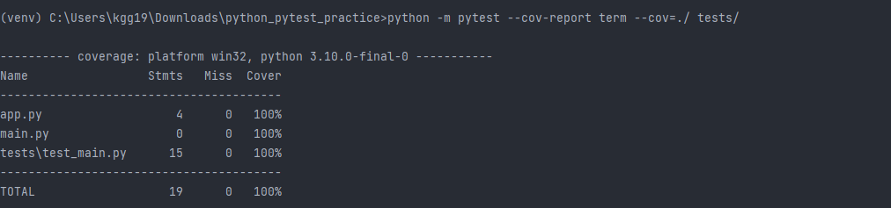
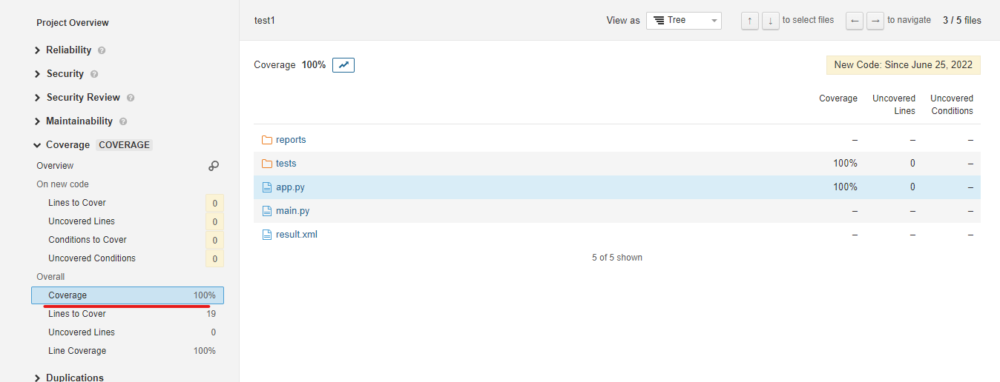

# 개요
* pytest 연습

# 실행방법
```shell
python -m pytest --cov-report term --cov=./ tests/
```



# 보고서를 sonarqube서버에 업로드

```sh
sonar-scanner.bat -D"sonar.projectKey={project이름}" -D"sonar.python.coverage.reportPaths=./reports/cov.xml" -D"sonar.sources=./"  -D"sonar.host.url={sonarqube서버 url}" -D"sonar.login={api_key}"
```

